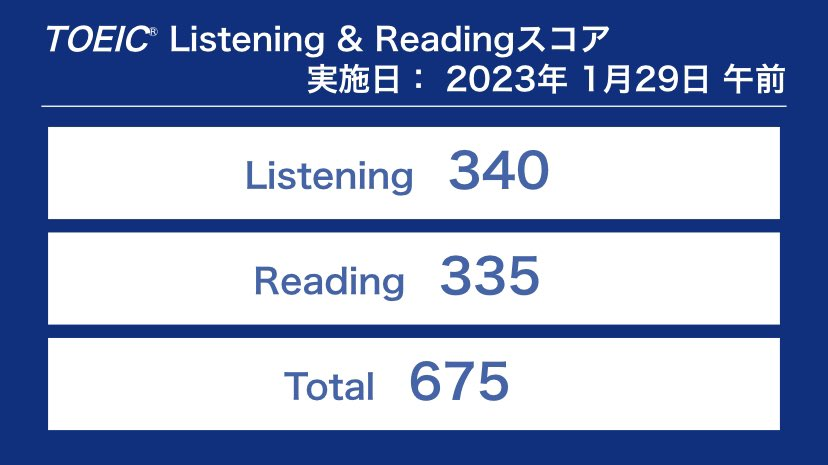

# はじめに

　こんにちは，管理人のBambooです．今回は，僕が最近実践している短期目標の設定について書きたいと思います．  
　「毎月の始めに月間目標を設定し，その目標を達成すること」これが僕の今年の目標です．この目標を設定した経緯や実際に実践していること，効果について書きたいと思います．

# 経緯
　皆さんは仕事のタスクや学校の課題を期日ギリギリに提出した経験はないでしょうか？僕はどちらかというとそういうタイプです．「まだ間に合う！」，「もう少し後回しにしてもいいや」，そう考えてしまいます．僕は去年応用情報技術者という資格を取得したのですが，振り返ってみると明らかに試験直前に勉強量が偏っていました．「受験に合格する」，「資格を取得する」，これ自体は立派な目標ですが，これだけでは勉強時間に偏りが生じたり，目標を達成するビジョンが見えにくい場合が多いです．  
　そこで登場するのが短期目標です．何かを達成するという目に見える大きな軸ではなく，その目標を達成するためにどういう行動を取るか，その行動をどれくらいの期間で達成するか，という小さな軸に焦点を当てた目標です．短期目標を設定するメリットは2つあります．

1. 目標達成に向けた行動を明確にする

　これは言うまでもないですが，目標を達成するためには，その目標を達成するための行動を取らなければなりません．短期目標を設定することで，その目標を達成するために，いつまでにどのような行動を取るか，ということを明確にすることができます．

2. 目標を達成するイメージがしやすくなる

　目標を達成するためには，当然ですが期日までに目標を達成できるレベルに到達しなければなりません．しかし，「〇〇を達成する」という漠然とした目標だけでは，何から取り組めばいいか，何を続ければいいか，いつまでに何ができるようになっていればよいか，ということがイメージしにくいです．短期目標を設定することで，目標達成に近づいているという実感がわき，自信に繋がります．

# 実践

　実際に僕が現時点で実践している短期目標を紹介します．短期目標は，誰かが介入するわけではなく完全に自分で設定するので，自分が無理なく取り組める内容や期間を設定します．僕は月間目標という大枠をまず決め，それに向けた小さな目標を毎日設定して実践するというスタンスを取っています．毎日の目標設定をここに書くのは無理があるので，以下に月間目標として設定したものを載せます．

## 1月の目標：TOEICで700点以上を取る

　今までTOEICの勉強をまともにできていなかったので，1月はTOEICの勉強に取り組むことにしました．1月末のテストだったため，1月に関しては月間目標=達成目標となっています．今回は700点を目標に取り組みました．具体的には，金のフレーズという単語帳とTOEICの公式問題集を使って，毎日少しずつ演習を行いました．先日結果が返ってきたので，結果の画像を載せます．

　う～ん，700点に到達していませんね．．．目標達成ならず．惜しい点数ではあるので，次回はもう少し高めの点数を目標にして取り組んでみようと思います．

## 2月の目標：大学数学を総復習する

　続いて大学数学です．かつて履修を行い，ちゃんと単位もとっていたはずですが，いざ問題を解いてみると意外と忘れている部分が多いです．そこで2月は，資格取得などの目に見える目標ではなく，教養として数学を身につけることを目標としました．復習には，マセマシリーズ各種や，各分野の参考書を用いました．結果として，よほど難しい問題でない限り解けるようにはなったと思います．

## 3月の目標：TOEICで800点を取るための勉強をする

　3月からは，1月に目標を達成できなかったことを反省し，TOEICの勉強を再開します．目標は無理のない範囲であれば高いに越したことはないので，3月中に次回のTOEICで800点を取れる程度の実力をつけることを目標にします．前回使用したTOEICの公式問題集よりも新しいバージョンが出版されているため，そちらを使って毎日少しずつ演習を行おうと考えています．ちなみに次回のTOEIC受験は4月下旬の予定です．（結果は発表され次第こちらのブログに載せようと思うので，楽しみにしていてください．）

# まとめ

　いかがだったでしょうか．僕自身は月間目標を設定していますが，これは週間目標であっても，あるいは1ヶ月よりも長い期間の目標であっても良いと思います．大事なのは，「決められた期間に対する目標を設定し，目標に向かって継続的に取り組むこと」です．もし今何か目標を持っているのであれば，ぜひ独自の目標スタイルを確立して，短期目標に取り組むことにチャレンジしてみてください．